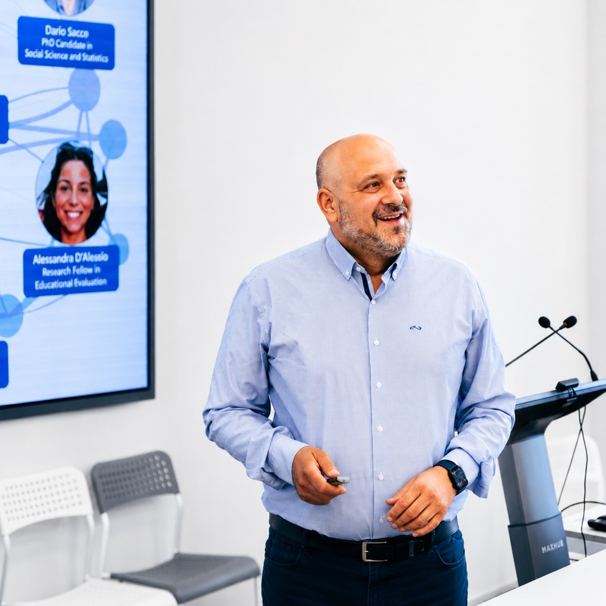

```{r}
#| label: home-metrics

# Pull live metrics from the same sources used by statistics.qmd,
# so the home-page stat strip stays in sync on every render.

suppressPackageStartupMessages({
  library(jsonlite)
  library(cranlogs)
})

scholar_id  <- "Qu66YZQAAAAJ"
cache_file  <- "scholar_cache.json"

# ---- Scholar (citations + h-index) via cache written by statistics.qmd ----
total_cites <- NA_integer_
h_index     <- NA_integer_

scholar_ok <- tryCatch({
  if (requireNamespace("scholar", quietly = TRUE)) {
    p <- scholar::get_profile(scholar_id)
    if (is.list(p) && !is.null(p$total_cites)) {
      total_cites <- as.integer(p$total_cites)
      h_index     <- as.integer(p$h_index)
      # Keep the shared cache warm for other pages
      jsonlite::write_json(
        list(profile = p,
             cite_history = scholar::get_citation_history(scholar_id)),
        cache_file, auto_unbox = TRUE, pretty = TRUE
      )
      TRUE
    } else FALSE
  } else FALSE
}, error = function(e) FALSE)

if (!scholar_ok && file.exists(cache_file)) {
  cache <- tryCatch(jsonlite::read_json(cache_file, simplifyVector = TRUE),
                    error = function(e) NULL)
  if (!is.null(cache$profile$total_cites)) {
    total_cites <- as.integer(cache$profile$total_cites)
    h_index     <- as.integer(cache$profile$h_index)
  }
}

# ---- CRAN total downloads for bibliometrix ----
bibl_total <- tryCatch({
  dl <- cran_downloads("bibliometrix", from = "2015-01-01", to = Sys.Date())
  as.numeric(sum(dl$count, na.rm = TRUE))
}, error = function(e) NA_real_)

# ---- Formatters ----
fmt_int <- function(x) {
  if (is.na(x) || !is.finite(x)) return("—")
  formatC(x, format = "d", big.mark = ",")
}

fmt_compact <- function(x) {
  # 1,350,000 -> "1.35M"  ;  980,000 -> "980K"
  if (is.na(x) || !is.finite(x)) return("—")
  if (x >= 1e6) sprintf("%.2fM", x / 1e6)
  else if (x >= 1e3) sprintf("%.0fK", x / 1e3)
  else formatC(x, format = "d", big.mark = ",")
}

# Floor citations to the nearest hundred so the "+" is honest
cites_display <- if (is.na(total_cites)) "—" else fmt_int(floor(total_cites / 100) * 100)
h_display     <- if (is.na(h_index))     "—" else as.character(h_index)
bibl_display  <- fmt_compact(bibl_total)
```

::: {.folio}
::: {.folio__figure}
{fig-alt="Portrait of Massimo Aria"}
:::

::: {.folio__head}
<div class="folio__eyebrow">Vol. XXIV · Personal Pages · MMXXVI</div>

<h1 class="folio__title">Massimo <em>Aria</em></h1>

<p class="folio__sub">Professor of Statistics for Social Sciences — University of Naples Federico II</p>

<dl class="folio__meta">
<dt>Fields</dt><dd>Bibliometrics · Science mapping · Machine learning · Text mining</dd>
<dt>Department</dt><dd>Economics and Statistics</dd>
<dt>Spin-off</dt><dd>K-Synth srl, co-founder</dd>
<dt>Software</dt><dd><em>bibliometrix</em> · <em>biblioshiny</em> · <em>TALL</em> · <em>openalexR</em></dd>
</dl>
:::
:::

::: {.stat-strip}
::: {.stat}
<span class="stat__num">200<span class="unit">+</span></span>
<span class="stat__label">Peer-reviewed articles</span>
:::
::: {.stat}
<span class="stat__num">`r cites_display`<span class="unit">+</span></span>
<span class="stat__label">Google Scholar citations</span>
:::
::: {.stat}
<span class="stat__num">`r h_display`</span>
<span class="stat__label">H-index</span>
:::
::: {.stat}
<span class="stat__num">`r bibl_display`<span class="unit">+</span></span>
<span class="stat__label">bibliometrix installations</span>
:::
:::

<span class="eyebrow">The long form</span>

::: {.dropcap}
Welcome. I am a full professor of Statistics for Social Sciences at the Department of Economics and Statistics of the University of Naples Federico II. My research lies at the intersection of **bibliometrics**, **science mapping**, **text mining**, **statistical modelling**, and **machine learning**.
:::

I am the author of over two hundred scientific articles and the creator of several open-source R packages, including the widely used [bibliometrix](https://www.bibliometrix.org) — with more than `r bibl_display` installations worldwide — and [TALL](https://github.com/massimoaria/tall), an interactive environment for text analysis. I am co-founder of [K-Synth](https://www.k-synth.com), an academic spin-off dedicated to transforming data into actionable knowledge through innovative statistical and computational methods.

Over the years I have led and contributed to numerous national and international research programmes — PRIN, PNRR, EU Framework, Horizon 2020 — and I actively support open science and reproducible research.

Beyond the academy, I am happily married to Adelaide and the proud father of Vittoria and Lorenzo — they keep life joyful, unpredictable, and deeply inspiring.

---

<span class="eyebrow">Navigate this site</span>

- [**Short Bio**](shortbio.qmd) — career, awards, and impact
- [**Curriculum Vitae**](cv.qmd) — positions, projects, editorial activities
- [**Publications**](publications.qmd) — selected journal articles and monographs
- [**Software**](software.qmd) — R packages and scientific tools
- [**Research Statistics**](statistics.qmd) — live metrics from Google Scholar and CRAN
- [**Projects**](projects.qmd) · [**Teaching**](teaching.qmd) · [**Photos**](photos.qmd) · [**Contacts**](contacts.qmd)
